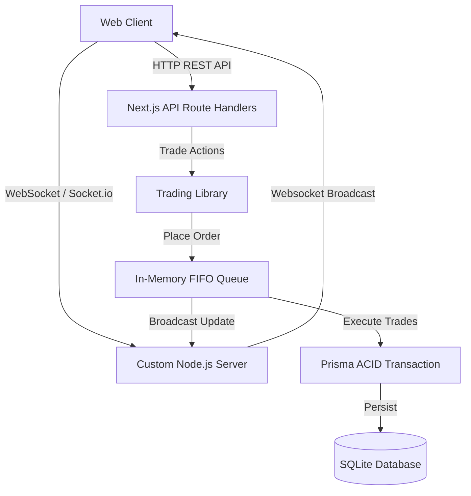

# Nebula Predict 🔮

A production-level, full-stack prediction market MVP featuring a real-time order book matching engine. Built with **Next.js**, **Express**, **Socket.io**, and **Prisma/SQLite**.

---

## Technical Architecture

Nebula Predict is architected to prevent common prediction market race conditions and double-spending vulnerabilities through a combination of in-memory queueing and ACID database transactions.



### 1. In-Memory FIFO Queue Matching Engine
JavaScript is single-threaded, but node asynchronous database operations are concurrent. If two opposite orders matched concurrently, we could double-allocate the same resting order. 
To resolve this, Nebula Predict routes order matching through a per-market **in-memory FIFO promise queue** (`src/lib/matching.ts`):
- Placement inserts the order into the DB and pushes it to the market's queue.
- The queue executes matches sequentially: it locks and updates order sizes, processes trades, transfers cash, and allocates shares.

### 2. Lock-on-Placement Collateral Management
To guarantee that a user cannot spend the same cash or shares twice across parallel resting limit orders:
- **BUY Orders:** The maximum possible cost of the limit order (`Quantity * Price`) is immediately deducted from the user's cash balance on placement. When a trade is matched at a better price (since resting asks can be cheaper than the buyer's limit), the price difference is refunded to the buyer. If the order is cancelled, the remaining quantity's locked cash is returned.
- **SELL Orders:** The shares representing the outcome being sold are immediately deducted from the user's position balance on placement. If the order is cancelled, the shares are returned.

### 3. Mint / Merge Bundle Mechanics
Rather than inventing dummy collateral or borrowing shares, Nebula Predict uses a mathematically closed binary contract model:
- **Minting:** A user locks $1.00 USD cash to mint exactly 1 YES share and 1 NO share. The total contract value remains constant ($1 YES + $1 NO = $1.00 USD). Users can sell whichever outcome they want to trade.
- **Merging:** A user combines 1 YES share and 1 NO share to release exactly $1.00 USD cash.
- This model maintains an exact 1-to-1 peg between the cash locked in the contracts and the outstanding outcomes.

### 4. Real-Time Syncing
A custom Node.js Express server (`server.ts`) wraps the Next.js compilation handler. It launches a Socket.io server on the same port, enabling instant, bidirectional messaging. When matches occur or books are edited, updates are broadcasted to active room subscribers, rendering price charts and depth books in real-time.

---

## Directory Structure

```
prediction-market-mvp/
├── prisma/
│   └── schema.prisma         # SQLite database schema models
├── src/
│   ├── app/
│   │   ├── api/
│   │   │   ├── auth/...      # NextAuth.js authentication router
│   │   │   ├── markets/      # Markets listing and creation endpoints
│   │   │   ├── portfolio/    # Consolidated user portfolio statistics
│   │   │   ├── trading/      # Places orders, cancels, mints, and merges
│   │   │   └── wallet/       # Balances and faucet claims
│   │   ├── layout.tsx        # Global HTML shell and fonts
│   │   ├── page.tsx          # Dashboard / active market listing
│   │   ├── login/page.tsx    # Frictionless Auth login page
│   │   ├── portfolio/page.tsx# User positions, values, open orders, trade log
│   │   └── admin/page.tsx    # Market creation and resolve panel
│   ├── components/
│   │   ├── Navbar.tsx        # Navigation and live balance + faucet
│   │   ├── OrderBook.tsx     # Bids & Asks depth table with visualization
│   │   ├── TradeForm.tsx     # Limit orders and Mint/Merge forms
│   │   └── PriceChart.tsx    # Custom SVG price spline history graph
│   ├── css/
│   │   └── globals.css       # Premium Glassmorphic design styling tokens
│   ├── lib/
│   │   ├── auth.ts           # NextAuth Credentials configuration
│   │   ├── db.ts             # Prisma client singleton helper
│   │   ├── matching.ts       # FIFO matching engine and socket broadcasts
│   │   ├── socket.ts         # Socket.io client setup
│   │   └── trading.ts        # Share minting, merging, and order handlers
│   └── types/
│       └── index.ts          # Common typescript interfaces
├── .env                      # Database credentials and session keys
├── next.config.mjs           # Next.js bundler settings
├── tsconfig.json             # TypeScript compiler settings
├── tsconfig.server.json      # Express compiler settings
└── server.ts                 # Custom Express server launcher
```

---

## Getting Started

### Prerequisites
- Node.js (v18 or higher)
- npm (installed with Node)

### Installation & Run

1. **Install Dependencies:**
   ```bash
   npm install
   ```

2. **Initialize Database:**
   ```bash
   npx prisma migrate dev --name init
   ```
   *Note: This creates the SQLite `dev.db` file and generates the Prisma client.*

3. **Start Development Server:**
   ```bash
   npm run dev
   ```
   *The custom server compiles server.ts on the fly and starts the combined Next.js + Socket.io app on http://localhost:3000.*

---

## Verification & Testing Guide

To verify the real-time matching and order book characteristics:

1. **Sign Up/Log In:**
   - Open [http://localhost:3000](http://localhost:3000) in Chrome. Click "Sign In".
   - Enter username `buyer` and password `password`. Since the account doesn't exist, it will auto-register and credit the wallet with `$1,000.00`.
   
2. **Open a Second Session:**
   - Open a Chrome **Incognito Window** (or another browser profile).
   - Go to [http://localhost:3000](http://localhost:3000) and sign in.
   - Enter username `seller` and password `password`.

3. **Mint & Place Asks (Seller Profile):**
   - On the `seller` account, click on the **Artemis II Moon Landing** market.
   - Go to the **Mint / Merge** tab. Input `50` pairs and click "Mint 50 Pairs". Note that Cash balance decreases by `$50.00`, and positions show 50 YES and 50 NO shares.
   - Go back to the **Limit Order** tab. Select **SELL**, outcome **YES**, price `0.65`, quantity `30` shares. Click "Place Order".
   - Note that YES shares in positions drop by 30 (resting limit order locks them).

4. **Verify Live Order Book & Match (Buyer Profile):**
   - On the `buyer` account, click on the same market.
   - You will see the `30` shares offered at `$0.65` immediately visible in the **Asks** section of the order book in real-time.
   - In the **Limit Order** tab, select **BUY**, outcome **YES**, price `0.65`, quantity `20` shares. Click "Place Order".
   - **Result:**
     - The trade is matched instantly!
     - In the `buyer` window: Cash decreases by `$13.00` (`20 * $0.65`), and positions show `20 YES` shares.
     - In the `seller` window: Cash increases by `$13.00`, and remaining resting SELL quantity drops to `10` in the order book.
     - The **SVG Price Chart** updates in real-time, plotting the YES price at `$0.65`.
     - The **Recent Trades** log records the trade details.

5. **Cancel Order (Seller Profile):**
   - In the `seller` window, scroll down to "Your Active Orders".
   - Click **Cancel** next to the remaining `10` shares order.
   - **Result:**
     - The order disappears from the order book.
     - The `10` locked YES shares are immediately returned to the seller's active positions.

6. **Market Resolution (Admin):**
   - Click on the **Admin** link in the navbar.
   - Find the market and click **Resolve YES**.
   - Navigate to **Portfolio** for both accounts:
     - The `buyer` holding `20 YES` shares receives a payout of `$20.00` cash.
     - The `seller` holding `30 YES` shares (20 remaining YES + 10 returned from cancellation) receives a payout of `$30.00` cash.
     - Both balances are successfully updated!
